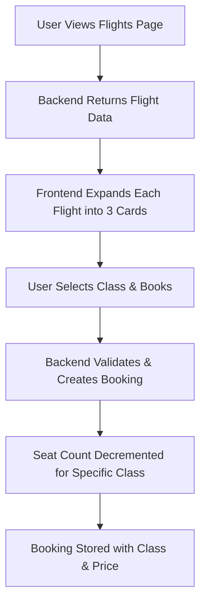

# Seat Classes Implementation Plan for Galaxium Travels

## Executive Summary

This plan outlines the implementation of three seat classes (Economy, Business, and Galaxium) for the Galaxium Travels booking system. Each flight will be displayed as three separate options on the flights page, allowing users to directly book their preferred class.

## Business Requirements

✅ **Three Seat Classes:**
- Economy (base price)
- Business (custom multiplier, typically 2x)
- Galaxium (custom multiplier, typically 3x)

✅ **Separate Inventories:**
- Each class has independent seat availability per flight

✅ **Display Strategy:**
- Flights listed separately by class on the flights page
- Users see all three options for each route

✅ **Data Migration:**
- Existing flights and bookings migrate to Economy class

## Architecture Overview



## Implementation Documents

### 1. [Database Schema Design](01-database-schema.md)
**Status:** Ready for implementation

**Key Changes:**
- Flight model: Replace single `price`/`seats_available` with class-specific fields
- Booking model: Add `seat_class` and `price_paid` fields
- Migration strategy for existing data

**Files Affected:**
- [`models.py`](../booking_system_backend/models.py:1)
- [`db.py`](../booking_system_backend/db.py:1)
- [`seed.py`](../booking_system_backend/seed.py:1)

### 2. [Backend API Changes](02-backend-changes.md)
**Status:** Ready for implementation

**Key Changes:**
- Update Pydantic schemas for new fields
- Modify `book_flight()` service to accept `seat_class` parameter
- Update `cancel_booking()` to restore seats to correct class
- Add validation for seat class values

**Files Affected:**
- [`schemas.py`](../booking_system_backend/schemas.py:1)
- [`services/booking.py`](../booking_system_backend/services/booking.py:1)
- [`server.py`](../booking_system_backend/server.py:1)
- [`tests/test_services.py`](../booking_system_backend/tests/test_services.py:1)
- [`tests/test_rest.py`](../booking_system_backend/tests/test_rest.py:1)

### 3. [Frontend UI/UX Changes](03-frontend-changes.md)
**Status:** Ready for implementation

**Key Changes:**
- Update TypeScript interfaces for new data structure
- Create utility functions for seat class handling
- Modify FlightCard to display single class
- Update Flights page to expand flights by class
- Add class filters and visual indicators

**Files Affected:**
- [`types/index.ts`](../booking_system_frontend/src/types/index.ts:1)
- [`utils/seatClass.ts`](../booking_system_frontend/src/utils/seatClass.ts:1) (new file)
- [`services/api.ts`](../booking_system_frontend/src/services/api.ts:1)
- [`components/flights/FlightCard.tsx`](../booking_system_frontend/src/components/flights/FlightCard.tsx:1)
- [`pages/Flights.tsx`](../booking_system_frontend/src/pages/Flights.tsx:1)
- [`components/bookings/BookingModal.tsx`](../booking_system_frontend/src/components/bookings/BookingModal.tsx:1)
- [`components/bookings/BookingCard.tsx`](../booking_system_frontend/src/components/bookings/BookingCard.tsx:1)

## Implementation Sequence

### Phase 1: Backend Foundation (Day 1-2)
1. ✅ Update database models
2. ✅ Create and run migration script
3. ✅ Update Pydantic schemas
4. ✅ Update service layer logic
5. ✅ Update REST and MCP endpoints
6. ✅ Update seed data
7. ✅ Write and run backend tests

### Phase 2: Frontend Integration (Day 2-3)
1. ✅ Update TypeScript types
2. ✅ Create seat class utilities
3. ✅ Update API service
4. ✅ Update FlightCard component
5. ✅ Update Flights page
6. ✅ Update BookingModal
7. ✅ Update BookingCard
8. ✅ Test end-to-end flows

### Phase 3: Testing & Refinement (Day 3-4)
1. ✅ Integration testing
2. ✅ UI/UX refinement
3. ✅ Performance optimization
4. ✅ Documentation updates
5. ✅ User acceptance testing

## Testing Strategy

### Backend Tests

**Unit Tests (`test_services.py`):**
- ✅ Book each seat class successfully
- ✅ Validate invalid seat class rejection
- ✅ Test sold-out scenarios per class
- ✅ Verify seat restoration to correct class on cancellation
- ✅ Test multiple bookings across different classes

**Integration Tests (`test_rest.py`):**
- ✅ REST API endpoints with all three classes
- ✅ Error handling for invalid requests
- ✅ Response structure validation

### Frontend Tests

**Manual Testing Checklist:**
- ✅ Flights page displays 3 cards per flight
- ✅ Class filters work correctly
- ✅ Sold-out classes are handled properly
- ✅ Booking modal shows correct class and price
- ✅ Booking confirmation includes class info
- ✅ My Bookings page shows class and price paid
- ✅ Responsive design on mobile/tablet/desktop

### Edge Cases

1. **All classes sold out:** Flight should not appear (or show as sold out)
2. **Only one class available:** Other classes show as sold out
3. **Price changes:** Historical bookings retain original `price_paid`
4. **Concurrent bookings:** Last seat in a class handled correctly
5. **Cancellation:** Seat restored to correct class inventory

## Data Migration Plan

### Step 1: Backup
```bash
# Backup existing database
cp booking_system_backend/galaxium_travels.db booking_system_backend/galaxium_travels.db.backup
```

### Step 2: Run Migration
```bash
cd booking_system_backend
python migrate_seat_classes.py
```

### Step 3: Verify
```bash
# Check that all flights have class-specific fields
# Check that all bookings have seat_class='economy'
python -c "from db import SessionLocal; from models import Flight, Booking; db = SessionLocal(); print('Flights:', db.query(Flight).first().__dict__); print('Bookings:', db.query(Booking).first().__dict__)"
```

### Step 4: Reseed (Optional)
```bash
# For development, reseed with proper class distribution
python seed.py
```

## Rollback Plan

If issues arise:

1. **Stop the application**
2. **Restore database backup:**
   ```bash
   cp booking_system_backend/galaxium_travels.db.backup booking_system_backend/galaxium_travels.db
   ```
3. **Revert code changes** (git revert or checkout previous commit)
4. **Restart application**

## Success Criteria

✅ **Functional Requirements:**
- Users can view flights by seat class
- Users can book any available seat class
- Bookings track class and price paid
- Cancellations restore seats to correct class

✅ **Technical Requirements:**
- All backend tests pass
- No breaking changes to existing functionality
- API responses include all class information
- Frontend displays classes correctly

✅ **User Experience:**
- Clear visual distinction between classes
- Intuitive booking flow
- Responsive design works on all devices
- Performance remains acceptable

## Risk Assessment

| Risk | Impact | Mitigation |
|------|--------|------------|
| Data migration fails | High | Backup database, test migration script thoroughly |
| Breaking API changes | High | Update frontend simultaneously, version API if needed |
| Performance degradation | Medium | Monitor query performance, add indexes if needed |
| User confusion | Medium | Clear visual indicators, tooltips, help text |
| Concurrent booking issues | Low | Database transactions handle race conditions |

## Post-Implementation Tasks

1. ✅ Update user documentation
2. ✅ Monitor error logs for issues
3. ✅ Gather user feedback
4. ✅ Consider future enhancements:
   - Dynamic pricing based on demand
   - Seat selection within class
   - Class upgrade options
   - Loyalty program integration

## Questions & Decisions Log

**Q: Should we allow class upgrades after booking?**
A: Not in initial implementation. Can be added later.

**Q: What if a flight has 0 seats in all classes?**
A: Flight should not appear in listings (filtered out).

**Q: Should we show price comparison between classes?**
A: Yes, users see all three options side-by-side for easy comparison.

**Q: How to handle partial refunds if prices change?**
A: Use `price_paid` field for refund calculations, not current price.

## Contact & Support

For questions about this implementation plan:
- Review the detailed documents in this folder
- Check the AGENTS.md file for development guidelines
- Refer to existing code patterns in the codebase

---

**Plan Created:** 2026-05-16  
**Last Updated:** 2026-05-16  
**Status:** Ready for Implementation  
**Estimated Effort:** 3-4 days